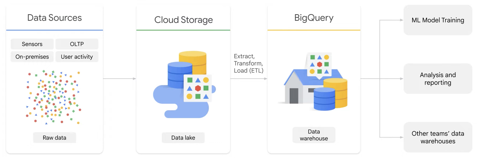
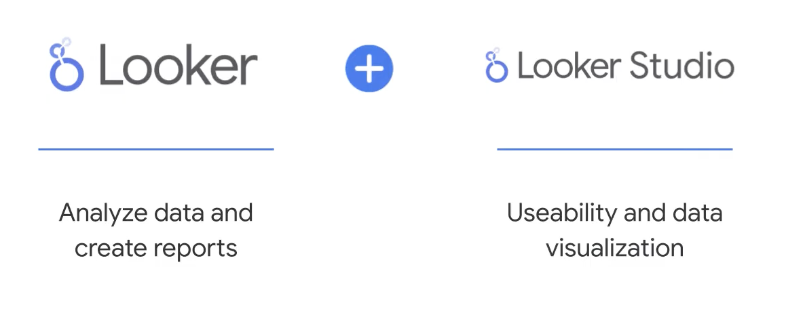

# **INTRODUCTION**

This module of the Introduction to Data Analytics on Google Cloud.

Focus on Google Cloud **data analytics workflow** and describes Google Cloud **data sources** and **storage methods**.

## **Data Analytics lifecycle**

The data analytics lifecycle provides a framework for organizing the different steps involved in data analytics.  

This framework can help to ensure that the necessary steps are taken, and that they are taken in the correct order. 

Storing, managing, and organizing your data is the foundation for data analytics on Google Cloud. 

This section began with an introduction to the data analytics lifecycle, including which Google Cloud products and services are best suited for each step.

### ***Ingest*** 
Products such as **Pub/Sub**, **Dataflow**, **Dataproc**, and **Cloud Data Fusion** are used to ingest and process both real-time and batch data.

**Cloud Data Fusion** It is a fully managed, cloud-first data integration service.

This code-free, extract, transform, and load–or ETL–tool integrates data across on-premises and cloud sources.

**Pub/Sub** is for ingestion and messaging, And **Dataflow** is for analytics and processing.

After data is ingested, it needs to be processed.
### **Process** 

**Dataproc** can be used to batch process data, **Dataflow** to stream data, or **Cloud Data Fusion** to integrate data from multiple sources.

### **Store**

Google Cloud storage options include **databases**, **data lakes**, and **data warehouses.**

**Google Cloud storage products include:** Cloud Storage, Cloud SQL, Cloud Spanner, Bigtable, Firestore, AlloyDB for PostgreSQL, and BigQuery.

**Cloud SQL, Cloud Spanner, and AlloyDB** for PostgreSQL are relational databases, whereas **Bigtable and Firestore** are NoSQL databases.

**BigQuery** is Google Cloud’s data warehouse solution.

### **Analyze**

BigQuery is at the core of data analytics on Google Cloud.

In addition to BigQuery, you can analyze data and visualize results by using **Looker** And **Looker Studio.** 

## **Data Sources**

Data sources are connectors that let you query data from various sources.

Google Cloud data sources can be classified into two categories: 
- **Cloud data sources** are data sources that are stored on Google Cloud 
- **External data sources** can be stored on-premises or in another cloud provider.

Now that you know what data sources, let’s explore storage options.

## **Store Options** 
The list of storage options includes: 

- **databases** is an organized collection of data stored in tables and accessed electronically from a computer system. 

- **data warehouses** is an enterprise system used for the analysis and reporting of structured and semi-structured data from multiple sources.

- **data lakes**  is a repository designed to ingest, store, explore, process, and analyze any type or volume of raw data, regardless of the source

## **BigQuery** 

BigQuery is the analytics engine that sits at the end of the data pipeline

BigQuery is the analytics engine that sits at the end of the data pipeline

It stores incoming data and then lets you do your analysis and model building.

BigQuery is actually two services in one: it’s both a fast SQL query engine and also a fully managed storage layer for loading and storing your datasets.

## **Looker** 

Looker is a powerful tool that helps you: 

- Access and review the data that your company collects.

- Answer data questions in real-time.

- Stay up-to-date with the status of your business.

- use data to drive decision making.

### **Looker interface** 

In Looker, an **Explore** is a report-builder interface, and a portal to ask questions by using your data.

Some od the fields for exploring data in Looker are 
- **Dimensions** are attributes or characteristics of your data.

- **Measures** are calculations performed across multiple rows of data

- **Filters** narrow the results returned based on specific criteria, so you can focus on a subset of your data based on desired characteristics

- **Pivots** let you turn a selected dimension into several columns, which creates a matrix of your data.

If you notice some interesting insights or trends in your data, you can save your findings to a dashboard or as a Look.

A Look is a single, saved report or visualization.
Looks typically answer an individual data question, and they can be added to a dashboard.
A dashboard is a series of saved reports, all on one page.

In addition to Looker, you can use **Looker Studio** to visualize your data.

Looker Studio features less analytics functionality and focuses more on a simple, easy to use interface for data visualization.

Looker Studio offers several features that make it easy to share and collaborate on reports.

You can publish reports to the web, and you can also embed reports in other applications.

The benefits of using Looker Studio for data visualizations include: 

- A drag-and-drop interface that makes it easy to create reports and dashboards.

- Various reports and dashboards, including charts, graphs, and tables.

- Powerful features that let you create professional-looking reports, such as the ability to add filters and drill down into data.

- Real-time collaboration on reports and dashboards.

- And security features that let you control who has access to your data.

Looker and Looker Studio can be integrated using the Looker connector for Looker Studio.

