# **BigQuery for Data Analysts**

This course is designed for data analysts who want to learn about using BigQuery for their data analysis needs

we will highlight analytics challenges faced by data analysts and compare big data on-premises versus on the Cloud.

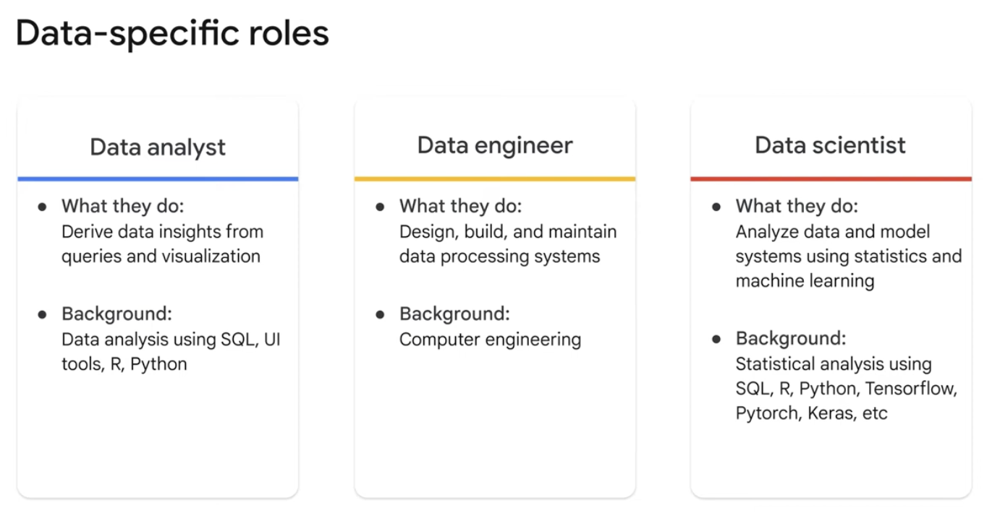

Data analysts, data engineers, and data scientists all analyze data sets to gain insights.

However, they have different roles: 
**Data analysts** primarily Gather and interpret data to solve problems and help companies make decisions.

They use SQL, and static modeling techniques, to summarize data, build reports and visualizations, and derive insights.

**Data engineers** Build systems for collecting, validating, and preparing data. They develop and maintain data pipelines

**Data scientists** Use dynamic techniques like machine learning to gain insights about the future.

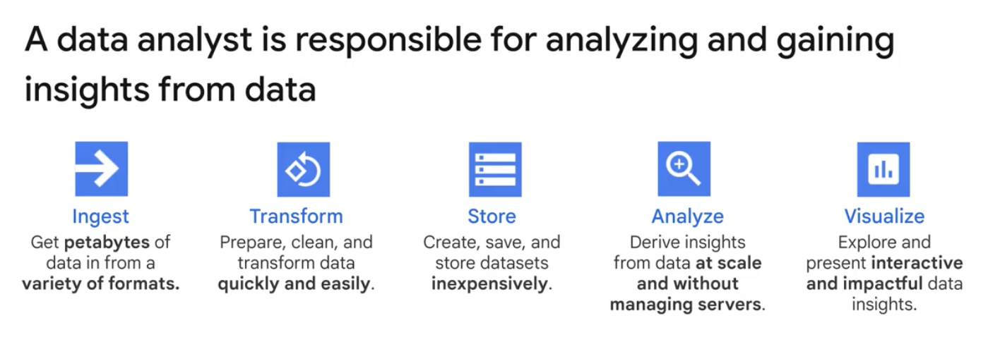

Ideally, the data analyst wants to be spending more time doing the last two tasks but BigQuery can help you with each of these data analyst tasks.

## Exploring and preparing your data with BigQuery

**Common data exploration techniques:**
There are three primary options for exploring a dataset: Write some SQL and use it in a SQL editor like:

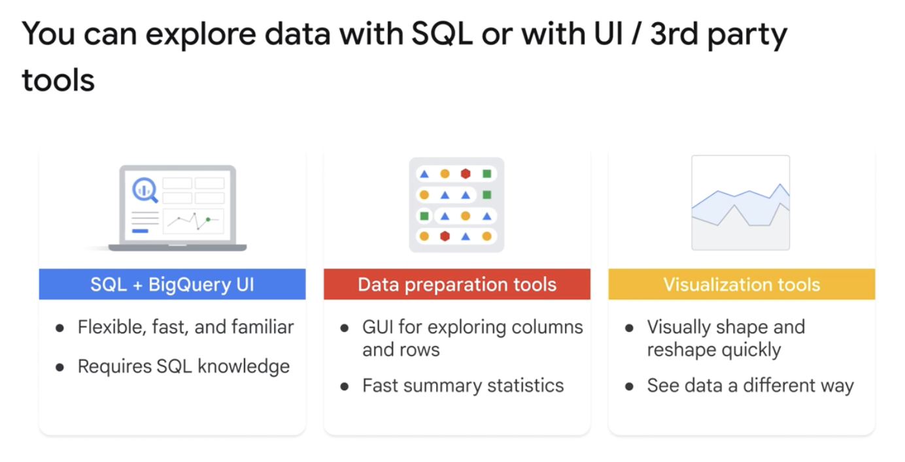

**Analyze large datasets with Bigquery:**
A public dataset is any dataset that is stored in BigQuery and made available to the general public through the Google Cloud Public Dataset Program.

The public datasets are datasets that BigQuery hosts for you to access and integrate into your applications.

**Query Basis:**
For the most part, queries in BigQuery are the same as when using other databases.

There is an international standard for SQL, with each version referred to with the term ANSI and the year it was adopted.

BigQuery SQL conforms to the ANSI 2011 version of the standards.

There are some minor differences specific to the platform, as is common with most SQL-based databases.

Some functionality has been added to support features unique to BigQuery: Arrays and structs Geography, and BigQuery ML

**Working with fuctions:**
This topic contains all functions supported by GoogleSQL for BigQuery. [Link](https://docs.cloud.google.com/bigquery/docs/reference/standard-sql/functions-all)

**Enrich your query with UNIONS and JOINS**

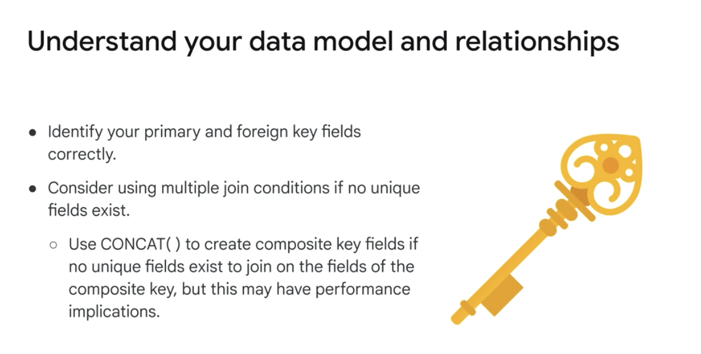

## Cleaning and Transforming your Data
One of the most critical parts of data analysis happens way before you build your first visualization. And while not necessarily the most glamorous, data preparation and transformation can't be ignored.
Mostly you will use SQL and data preparation tools for this crucial step.

**5 Principles of dataset integrity**
The majority of data quality lectures will have one central theme: Garbage in, garbage out.
So if you want to build amazing machine learning models, you can't feed them with garbage.

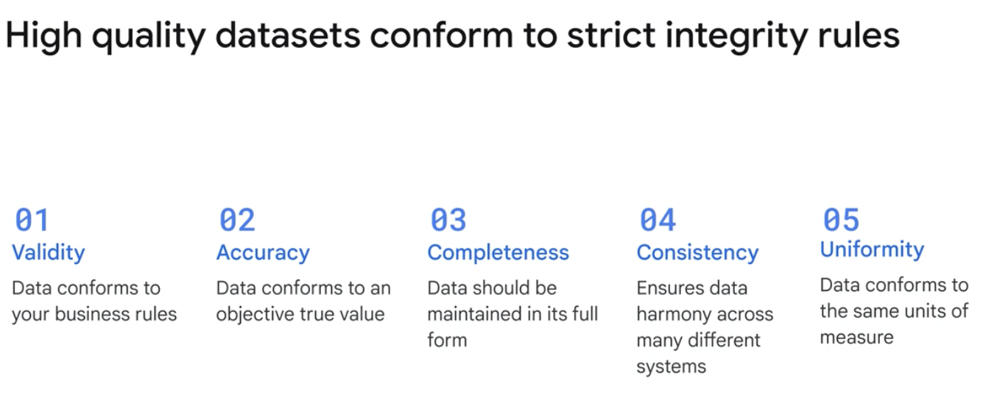

## Ingesting and Storing New BigQuery Datasets

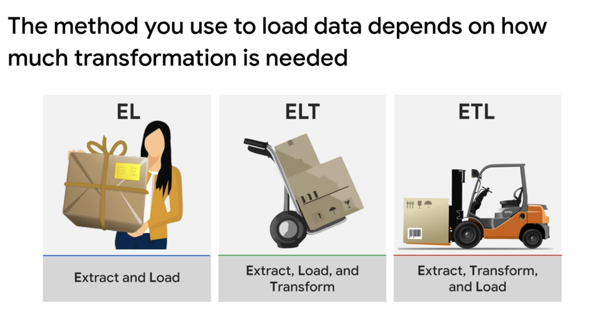

**EL**, or **Extract and Load**, is used when data is imported as-is, where the source and target have the same schema.

**ELT**, or **Extract, Load, Transform**, is used when raw data will be loaded directly into the target and transformed there.

**ETL**, or **Extract, Transform, Load**, is used when transformation occurs in an intermediate service before it is loaded into the target.

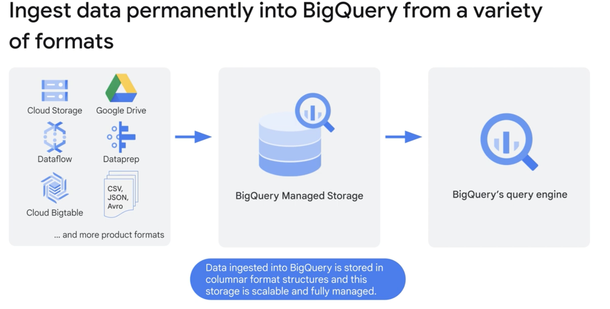

When EL or ELT is preferred, BigQuery can ingest datasets from a variety of different formats.

Once data is inside BigQuery native storage, it is fully managed by the BigQuery team at Google.

Sometimes, the transformations are rather complex, and large enough in number that ETL may be the best option.

In such cases, you can always use services like Cloud Data Fusion, Dataflow, or Dataproc to build your pipelines and code the transformations that need to be applied first before the data is loaded into a target destination like BigQuery.

**External data sources** 
An external data source is a data source that you can query directly from BigQuery, even though the data is not stored in BigQuery storage.

## Visualizing Your Insights from BigQuery

One of the key outputs that data analysts create are insightful reports for their audience.

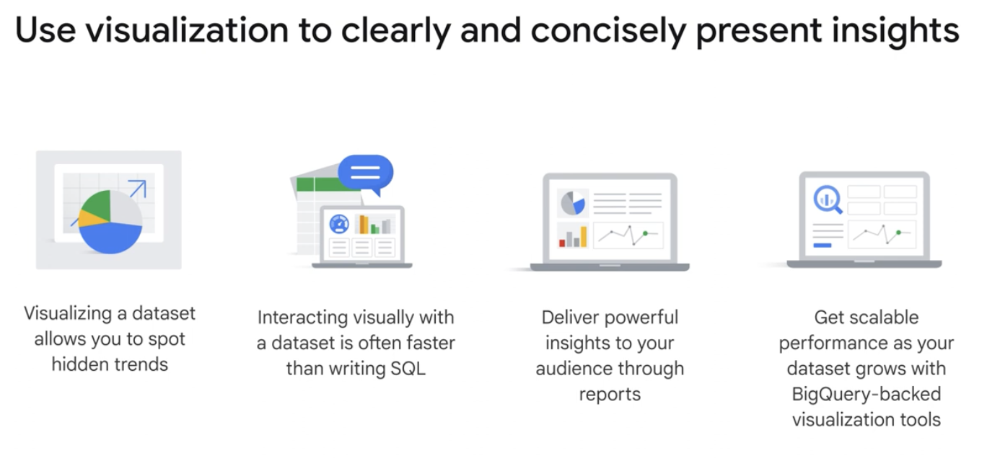

Your visuals and reports often carry more visual weight than your SQL scripts and analysis.
One of the core concepts that you will come across in many visualization tools is dimensions versus measures.

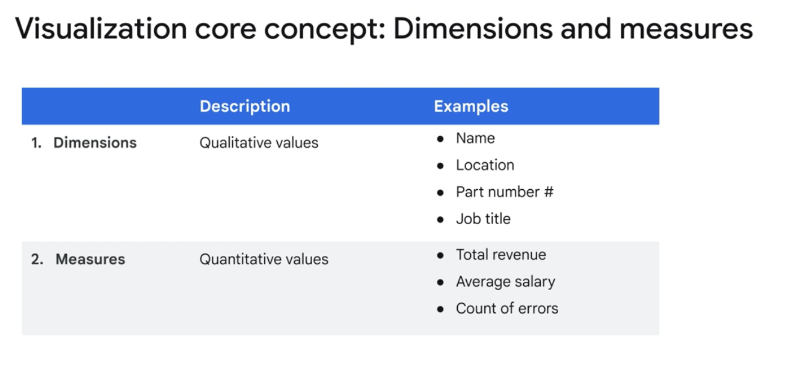
One of the core concepts that you will come across in many visualization tools is dimensions versus measures.
These concepts are built into how visualization tools create informative and insightful visualizations.

**Looker Studio**

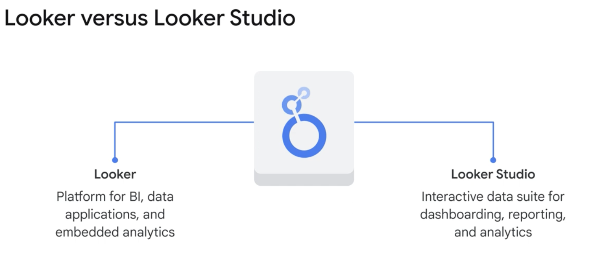

Looker is a business intelligence software and big data analytics platform that helps users explore, analyze, and share real-time business analytics.

Looker Studio, formerly known as Data Studio, is a web interface that makes it easy to create interactive dashboards and reports from a wide variety of sources, driving smarter business decisions.

## Developing Scalable Data Transformation Pipelines in BigQuery with Dataform.

Dataform helps data teams build, version control, and orchestrate SQL pipelines in BigQuery.
We are seeing a trend where organizations are slowly moving from an ETL approach, with their pipelines in dedicated ETL tools and environments like Spark, to an ELT approach, with SQL pipelines in BigQuery.

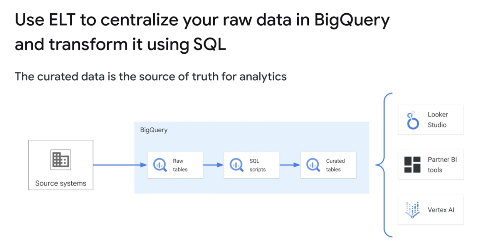

With **dataform**, you can develop and operationalize scalable data transformation pipelines in BigQuery using SQL.

The framework enables data teams to build a central data model, a single source of truth, with tables that are curated, continuously updated, documented, and tested without managing infrastructure.

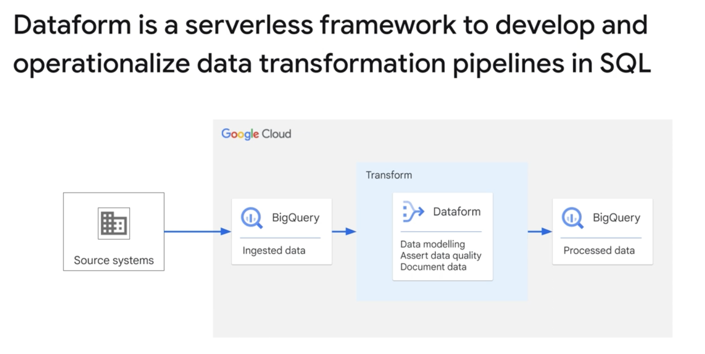

Dataform’s framework lets you do all the things you want like create table definitions, assert data quality, document tables, and so on, all in a single environment and without additional dependencies.

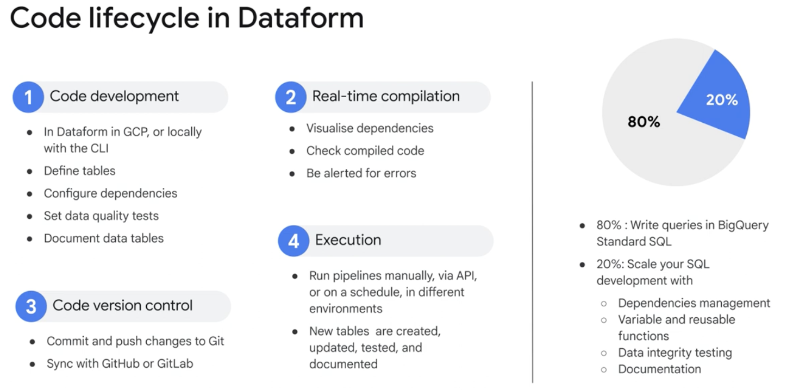

