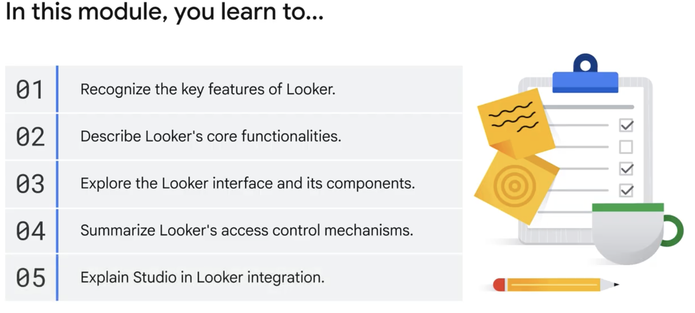
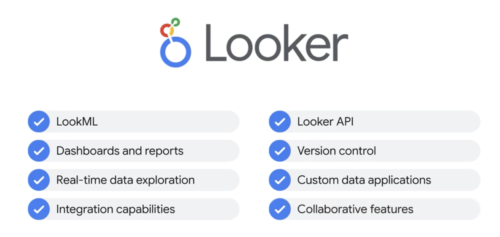
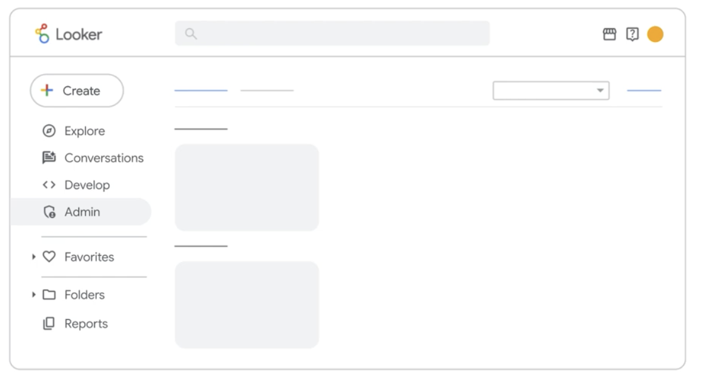
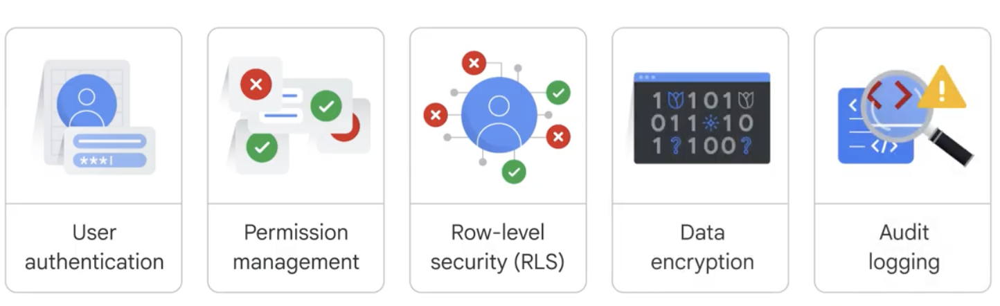
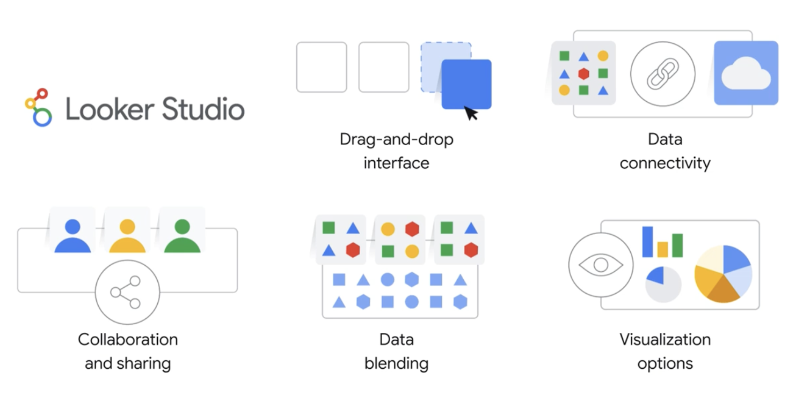
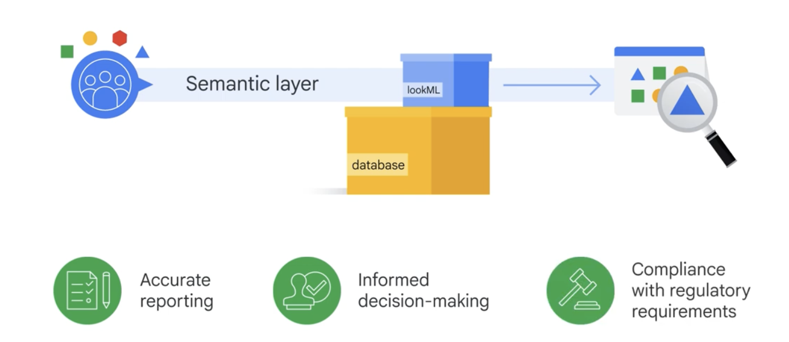
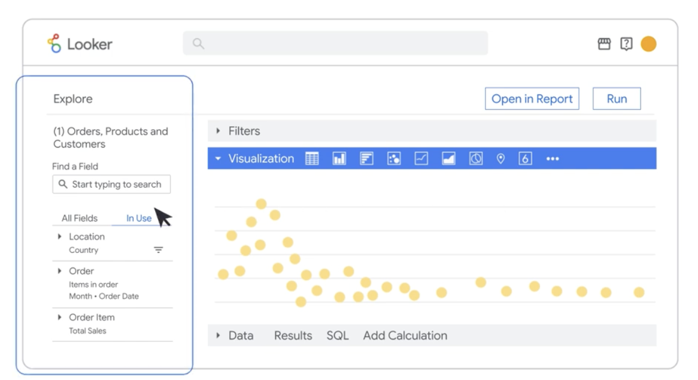
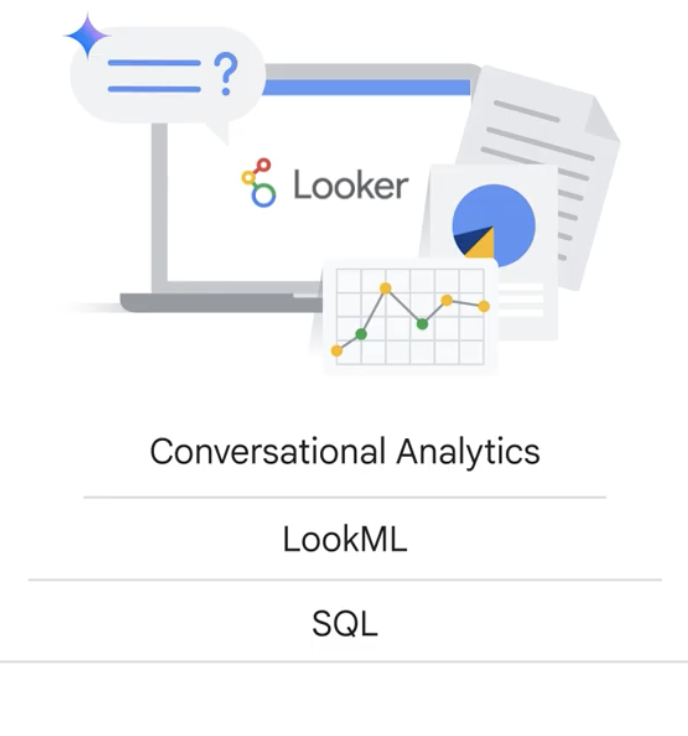

 

Looker is a powerful business intelligence and data visualization platform. With Looker, you can connect to various data sources including databases, spreadsheets, and cloud services; explore and analyze data using an intuitive drag-and-drop interface; create interactive dashboards, visualizations, and reports to share with your team and foster collaboration; and embed Looker content into other applications and websites.

## Key Features

**LookML** makes it easy to define dimensions, measures, business rules, and metrics.
This ensures everyone in your organization is working with consistent and accurate data.

Looker makes it easy to create customizable **dashboards and reports**.

The intuitive **drag-and-drop** interface allows you to build dynamic dashboards and detailed reports.

You can also easily share these reports with your team members, ensuring everyone has access to the latest insights.

Looker **integrates** seamlessly with a wide range of data sources, including Google Analytics, Google Ads, BigQuery, and many others, giving you a unified view of your data landscape.

For developers and advanced users, the **Looker API** provides a secure way to manage your Looker instance and retrieve data programmatically.

You can use the API to integrate Looker with other applications, automate tasks, build custom tools, and much more.
This gives you greater flexibility and control over your data and workflows.

**Navigating through Looker**

It's divided into several sections, but keep in mind that the sections you see may vary depending on your user role and permissions.

**Create** this button allows you to quickly create new Looker content, such as dashboards, looks, reports, and explorers. Explore-- the Explore section is the heart of Looker's data exploration capabilities.

**Conversations** Looker enables users to interact with data using natural language, making it easier to explore and understand insights.

**Develop** this section is primarily for developers. It allows them to create custom explorers, reports and dashboards using LookML, Looker's powerful data modeling language based on SQL.

**Admin** this section is only available to users with administrative permissions.

**the importance of security in Looker.**
Looker offers a comprehensive set of security features to protect your data and ensure that only authorized users can access and interact with it.
These features include:

Looker provides various **authentication methods**, such as username/password, LDAP, Google OAuth, and SAML, to ensure that only authorized users can log in to the platform.

Looker allows you to define and assign roles and permissions to users and groups, granting them access to specific content, features, and data.

RLS is a powerful feature that enables you to control access to data at the row level.

Looker encrypts data in transit. This helps protect your data from unauthorized access and ensures its confidentiality even if a security breach occurs.

Audit logs are essential for maintaining compliance, troubleshooting issues, and identifying any suspicious activity.

**How Looker Studio integrates with the Looker platform**

Looker Studio, formerly known as Google Data Studio, is a free web-based tool that allows you to create interactive dashboards and reports from various data sources.

Some of the key features of Looker Studio include

## Understanding LookML and the semantic layer

 Looker's data modeling language and its role in creating a semantic layer for consistent and reliable data analysis.

The **semantic layer**, built with LookML, acts as a central source of truth for data definitions, ensuring that everyone in your organization is working with the same data, understanding.
This consistency is essential for effective data governance, as it enables accurate reporting, informed decision-making, and compliance with regulatory requirements.
Given this, Looker's **data-governance** features help ensure your data is accurate, consistent, and accessible to the right people.

## Governed BI and analytics in Looker.

Governed business intelligence and analytics refers to the processes and technologies an organization uses to ensure that its data is accurate, consistent, and trustworthy.
It also ensures that the data is accessible to the right people at the right time. Data governance is crucial because it establishes policies, procedures, and responsibilities for data management.

Looker achieves data governance through its semantic layer, LookML. 
LookML provides a consistent and centralized way to define data and business metrics.

**Explores in Looker** 

Explores are a fundamental part of the Looker experience.
They provide a user-friendly interface for querying and analyzing data.
You can select fields, apply filters, and visualize the results without writing any code
And because Explores are connected to LookML, you can be confident that you're working with consistent definitions and calculations.

**Creating user-defined dashboards in Looker**

Dashboards in Looker, also known as LookML dashboards, provide a way to present key data insights in a clear, concise, and interactive format.
User-defined dashboards are personalized dashboards created by users to save, organize, and share data visualizations and reports.
They allow you to curate and present data stories tailored to specific audiences or purposes.

**Gemini in Looker**

Gemini in Looker brings the power of generative AI directly into your data experience. It's designed to make Looker more intuitive and efficient, helping both analysts and business users get insights from data faster.

Essentially, Gemini assists you with various tasks within Looker, including writing LookML code, creating visualizations, answering questions about your data using natural language, and offering AI-generated insights from your data.

**Conversational analytics in Looker**

  

Conversational analytics is a Gemini-powered feature that empowers users of all skill levels to ask questions about their data in natural language, instead of writing complex SQL queries.
Gemini interprets these questions and retrieves the relevant data from Looker to provide clear and concise answers, often including helpful visualizations and supporting data tables.

A **key benefit** of conversational analytics is that it runs on top of the LookML semantic layer.
This ensures users get trustworthy answers, as **the semantic layer uses consistent definitions and prevents Gemini from hallucinating or generating incorrect code.**
This is a significant differentiator for Looker compared to other business intelligence and analytics products on the market.

**Self-Service Dashboarding and Reporting**

Self-service dashboarding and reporting empowers users at all levels of an organization to access, analyze, and visualize data without relying heavily on IT or a dedicated analytics team.
Instead of submitting requests and waiting for reports, individuals can create their own dashboards and reports using governed or personal data, or a blend of both, to answer specific business questions.

## External Analytics and Embedding

**External analytics** refers to the practice of providing data insights and reports to individuals or groups who are not direct users within your Looker instance.

The goal is to extend the reach of your data beyond your internal team, enabling informed decision-making across a broader audience.

When external parties have access to customized dashboards and reports, they can make more informed decisions related to your products, services, or joint ventures.

**How Embedding Looker**

Embedding Looker refers to the process of integrating Looker dashboards, explores, or looks directly into other applications, websites, or business intelligence platforms.
This means your users don't need to navigate to Looker to access the data. Instead, the data comes to them right within the environment they already use.

Instead of providing a link to a separate Looker report, you can display that report directly within your customer portal, your internal company dashboard, or even a partner application.

**At a high level, Looker embedding typically works by utilizing an HTML iframe or through a more advanced JavaScript API.**

The iframe method is straightforward, allowing you to simply embed a Looker URL within a frame on your web page.

For more robust and interactive integrations, the Looker Embed SDK allows developers to programmatically control the embedded content.

