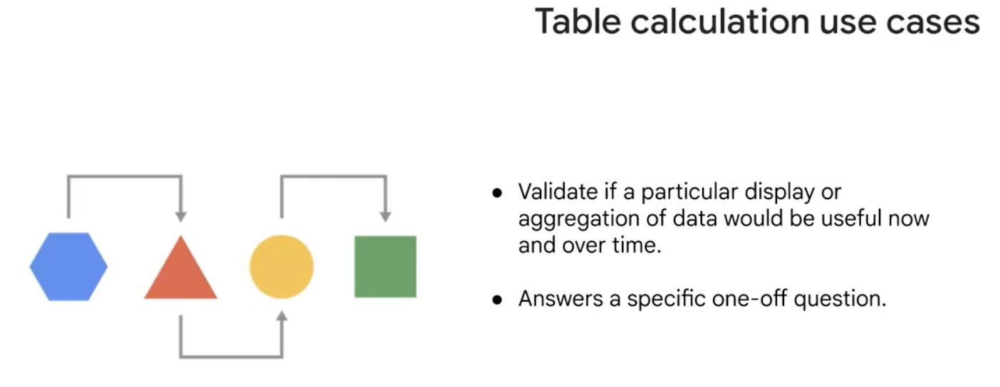

 

# What is looker? 

Looker is a powerful enterprise scale data platform that allows business users to see consistent data through their preferred method, enabling them to analyze the most current data to make data-based business decisions immediately.

To consider how Looker can support your data workflows, let's examine the overall data analysis process and the role of Looker in this process.

**1. Define questions.** 
Identify what questions need to be answered using your data.

**2. Identify required data**
Determine the specific dimensions and measures you will need to answer those questions.

**3. Analyze data**
Explore the dimension and/or measure relationships via tables and visualizations. This exploration of your data should empower you to take some kind of action or make some kind of decision with regard to your work.

**4. Interpret the results**
Glean actionable insights from your analyzed data.

## Data analysis building blocks

**Dimensions** are attributes or characteristics of your data. Specifically, each column in a database table is a dimension in Looker.

**Measures** are calculations performed across multiple rows of data. As such, measures are aggregates of data attributes, or dimensions.

In summary, dimensions help you to identify and select data attributes that you need to answer your questions in Looker.

In Looker, **filters** are ways to reduce or narrow down the results returned based on specific criteria.

In this way, filters allow you to hone in on a subset of your data based on desired characteristics. A key feature of filters is that they don’t delete anything from the database; they’re only applied to the data that Looker displays on your screen.

### Working with Looker content

Working with **dashboards** to look for insights, trends and to answer data-related questions is very powerful, and Looker makes it easy.

Editing dashboards to add new content or revise the existing layout is also very easy. In edit mode, you’ll see options to add tiles and filters to the dashboard, as well as modify its settings to configure how the dashboard runs and refreshes.

**Boards** are a great way to centralize relevant content that lives in different folders within your organization’s Looker instance.
The great thing about boards is that they simply link to a content item such as a Look or dashboard, which remains in its original location.
In summary, boards are a great way to centralize and share content that lives in different folders within your organization’s Looker instance.

**pivots** allow you to turn a selected dimension into several columns, which creates a matrix of your data similar to a pivot table in spreadsheet software.
This is very useful for analyzing metrics by different groupings of your data, such as getting counts for category or label in your dataset.
In summary, pivots allow you to create and display a matrix of your data, similar to a pivot table in spreadsheet software.

**Table Calculation**
in Looker, data explorers are given access to one or more explorers predefined by LookML developers. At your own company, that would likely mean your data and analytics team, data engineers, or data analysts. But sometimes, you'll find you need particular logic for which they haven't provided a dimension or measure, maybe because you have a new kind of question or use case.

  

Table calculations are used to define what we call on-the-fly metrics, because they run on your query results instead of your whole database.

In Looker, table calculations provide you with the ability to define new metrics instantaneously using custom formulas.
With table calculations, you can prototype new metrics or create one-off visualizations from your query results, without having to wait for a LookML developer to modify the options available in a particular Explore. There are four basic types of table calculations in Looker: **String, mathematical, logical, and date & time.**

String functions operate on text results, while mathematical functions operate on numeric results.

Data & time functions operate on datetime results, and logical functions can be used to check one or more conditions and execute different paths of logic, depending on the value.

In summary, table calculations allow you to create new metrics instantaneously and are incredibly useful for prototyping new metrics or creating one-off visualizations.

**Offset functions** are a subset of table calculation functions. They allow you to programmatically reference values from other rows or columns in your query results to calculate new values.
There are three main types of offset functions-- regular offset, offset_list, and pivot_offset. 

A **regular offset** function is used when you want to reference a value from a higher or lower row of your results. Note that changing the order of the rows by sorting your results can turn the previous row into the subsequent row, and vice versa. 

The **pivot_offset** function is used to reference values from a column to the left or the right when you have a pivot table.

The **offset_list** function moves up or down a column of rows defined by a first provided value and then grabs a number of rows worth of data defined by a second provided value. The two numbers can be the same or different, depending on the results you want.

### Creating new Looker content

Looker provides many ways for you to analyze, visualize, and share your data. If you're looking to create a report that answers one specific question of your data, you should consider **creating a Look**, which is a single standalone report in Looker.

Once created, a Look can be saved, favorited, shared, or even scheduled for regular delivery.

In Looker, dashboards can be used to combine individual visualizations, which are referred to as tiles on the dashboard.

Just like a **look** is a single visualization designed to answer one specific data-related question, a dashboard usually contains multiple visualizations and is designed to answer multiple data-related questions.

### Sharing Looker data with others

Anytime you want to share or export content from Looker, we call that “data delivery.” You can deliver data from Looks, Explores, or dashboards, and to make it easy for you, the process for each is very similar.

