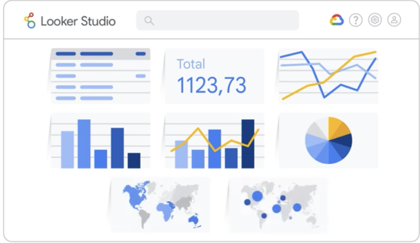
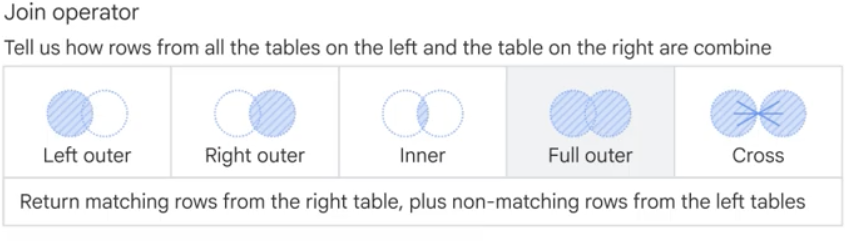

## Introduction to Looker Studio

Looker Studio, formerly known as Google Data Studio, is a free web-based tool that enables users to transform raw data into informative, customizable, and sharable reports.
It's ideal for when you need to visualize data, share it with others, and make it interactive.
There are several benefits of using Looker Studio.

Firstly, it's coste effective.
As a free tool, Looker Studio provides robust data visualization capabilities without the need for significant financial investment.

Second, Looker Studio has a user-friendly interface.
It's easy to use thanks to the intuitive drag and drop functionality.

Third, Looker Studio provides multiple data refresh options. This means you can set up rules to control how often to refresh your data.

Looker Studio offers a wide range of powerful features to support your data reporting.

- Analyze and visualize your data through highly configurable charts and tables.
- Easily connect to a variety of data sources.
- Perform data blending to enhance data visualization and analysis.
- Apply controls and filters to add interactivity to your repor

## Visualization in Looker Studio.

Looker Studio provides a number of preconfigured **charts** that you can add to your report and then customize as needed. 
Charts allow you to analyze and present your data using different visualization techniques. They can also be used as filters, allowing viewers to interact with your reports and explore data in more detail.
Here are some common chart types.
Table, scorecard, bar, column, time series, combo, pi, geo, and Google maps.

  

  ## Data sources in Looker Studio

Connecting to your data involves the following components.

**Connectors** 
These are used to connect Looker Studio to your underlying data.

**Data sources** 
These represent a particular instance of a connector.

Looker Studio provides access to more than 1,000 connectors.
Connectors are specific to the kind of data you want to visualize in Looker Studio. For example, Google has built connectors to various Google and non- Googlele products, including BigQuery, Google Sheets, Google Analytics, and MySQL databases.

There are three different types of credentials when you connect Looker Studio to your data.
**Owner's credentials** use the credentials of the data source owner to authorize access to the data set.
This option lets you share reports that use this data source without requiring report viewers to have their own access to the underlying data set.
**Viewer credentials** require anyone who attempts to view the data provided by this data source to have their own access to the data set.
**Service account credentials** use a special type of Google account that is intended to represent a non-human user that can authenticate and be authorized to access your data.

## Data blending in Looker Studio

Blending data lets you create charts, tables, and controls from multiple data sources.
Database programmers use SQL join statements to blend data from different tables. Blends in Looker Studio work similarly, but you don't need to write the code.
Instead, you use the blend editor to configure the join.
The blend editor contains seven sections, tables, join configuration, join another table button, blend name, included dimensions and metrics, add metrics, date range, and filters.

Looker Studio supports the following join operators.

 

 ## Adding Interactivity and Exploring Data

 Looker Studio offers several types of controls.

 The first set of controls, drop-down list, fixed size list, input box, advanced filter, slider, checkbox, and preset filter can filter data or set parameter values.

 The second set, date range control, data control, dimension control, and button performs specialized functions and cannot set parameter values.

 Generally, search operators for text dimensions are case-sensitive, though this varies by connectors.

 **How quick filters and buttons in Looker Studio add interactivity to reports**

 Quick filters provide a flexible ad hoc way to explore your data. They allow you to easily change how the report data is filtered without affecting the report configuration for other users.

 